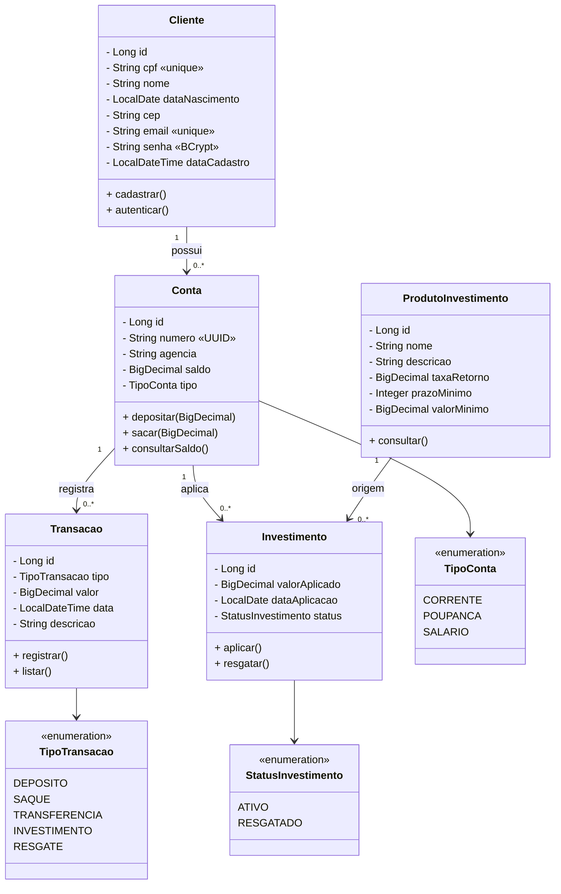

# BRICS_Payment

## Definição de Escopo

#### 1. Mapeamento de Usuários

- **Cliente (Usuário Comum)**: Pode realizar cadastro, login, saques, depósitos, consultar extrato e adquirir investimentos.

- **Administrador (Admin)**: Responsável pela gestão de usuários, visualização de relatórios gerais e monitoramento de transações.

#### 2. Requisitos Técnicos

- **Frontend**: Interface web responsiva para apresentação visual de todo o sistema.

- **Backend & API REST**: Servidor para processamento das regras de negócio e exposição de endpoints para cadastros, saques, extratos e depósitos.

- **Persistência de Dados**: Banco de dados relacional para armazenar informações de clientes, contas, transações e investimentos.

- **Validação**: Implementação de regras para garantir o controle de limites de saque, insuficiência de saldo e produtos contratados.

- **Configuração por Ambiente**: Uso de variáveis de ambiente, como .env no frontend e application.properties no backend, para separar configurações de desenvolvimento e produção.

#### 3. Backlog Inicial

- CRUD de Clientes: Cadastro, leitura, atualização e exclusão de clientes.

- Autenticação e Autorização: Login com JWT para diferenciar permissões entre cliente e admin.

- Operações Bancárias: Depósito, saque e transferência entre contas.

- Extrato: Histórico de transações com filtros por período.

- Investimentos: Compra e resgate de produtos de investimento.

- Testes de Integração: Validar regras de negócio (ex: não permitir saque se saldo insuficiente).

### Prototipagem e Contratos

#### 1. Protótipos de Integração (Wireframes)

- **Tela de Cadastro**: Campos de CPF, nome, data de nascimento, CEP, e-mail e senha. Ao submeter, o frontend dispara a requisição à API.

- **Tela de Login**: Campos de CPF e senha. Ao submeter, o frontend dispara a requisição à APÍ.

- **Tela de Dashboard**: Exibe saldo, últimas transações e atalhos para depósito, saque e investimentos.

- **Tela de Extrato**: Listagem de transações com filtros por data e tipo.

- **Tela de Investimentos**: Catálogo de produtos disponíveis com opção de compra.

#### 2. Contratos da API (Documentação Técnica)

#### Endpoint: Cadastro de Cliente

- **Rota**: `POST /api/v1/clientes`
- **Corpo da Requisição (JSON)**:
```json
{
  "cpf": "123.456.789-00",
  "nome": "João Silva",
  "dataNascimento": "1990-01-01",
  "cep": "01001-000",
  "email": "joao@email.com",
  "senha": "senha123"
}
```
- **Resposta de Erro (400 Bad Request):** Caso CPF ou e-mail já estejam cadastrados, ou dados inválidos.

#### Endpoint: Realizar Depósito

- **Rota**: `POST /api/v1/contas/{contaId}/deposito`

- **Corpo da Requisição (JSON)**:

```json
{
  "valor": 100.00
}
```

- **Resposta de Sucesso (200 OK)**:

```json
{
  "id": 1,
  "contaId": 101,
  "tipo": "DEPOSITO",
  "valor": 100.00,
  "data": "2026-08-18T10:00:00"
}
```

- **Resposta de Erro (400 Bad Request)**: Caso o valor seja negativo ou zero.

##### Endpoint: Realizar Saque

- **Rota**: `POST /api/v1/contas/{contaId}/saque`

- **Corpo da Requisição (JSON)**:

```json
{
  "valor": 50.00
}
```

- **Resposta de Sucesso (200 OK)**:

```json
{
  "id": 2,
  "contaId": 101,
  "tipo": "SAQUE",
  "valor": 50.00,
  "data": "2026-08-18T10:05:00"
}
```

- **Resposta de Erro (400 Bad Request)**: Caso o saldo seja insuficiente.

##### Endpoint: Comprar Investimento

- **Rota**: `POST /api/v1/investimentos`

- **Corpo da Requisição (JSON)**:

```json
{
  "contaId": 101,
  "produtoId": 5,
  "valorAplicado": 1000.00
}
```

- **Resposta de Sucesso (201 Created)**:

```json
{
  "id": 10,
  "contaId": 101,
  "produtoId": 5,
  "valorAplicado": 1000.00,
  "dataAplicacao": "2026-08-18",
  "status": "ATIVO"
}
```

- **Resposta de Erro (400 Bad Request)**: Caso o saldo seja insuficiente ou o produto não esteja disponível.

#### 3. Documentação de Fluxo e Comunicação

- O **Frontend (Angular)** utiliza o módulo HttpClient para consumir os endpoints da API REST.

- O **Backend (Spring Boot)** valida o contrato recebido antes de processar a regra de negócio na camada de serviço.

- As mensagens de erro da API são padronizadas em um formato JSON consistente, permitindo que o frontend exiba alertas claros ao usuário, como por exemplo: "Saldo insuficiente para esta operação".

---

## Definição de Arquitetura

### 1. Visão Geral da Arquitetura

- **Padrão Arquitetural**: MVC (Model-View-Controller) no backend para separar a lógica de negócio do acesso a dados.

- **Camadas do Backend**:
  - **Controller**: Expõe os endpoints REST.
  - **Service**: Contém as regras de negócio.
  - **Repository**: Acesso a dados via Spring Data JPA.

- **Frontend**: Estrutura em componentes Angular, com serviços para comunicação com a API.

### 2. Tecnologias Selecionadas (Stack Tecnológica)

- **Frontend**: Angular 15 com TypeScript, utilizando módulos como HttpClient e Reactive Forms para validação.

- **Backend**: Java 17 com Spring Boot, utilizando Spring MVC, Spring Data JPA, Spring Security e Spring Validation.

- **API REST**: Formato JSON para troca de mensagens, seguindo os verbos HTTP padronizados (GET, POST, PUT, DELETE).

- **Persistência de Dados**: PostgreSQL, garantindo integridade referencial e consistência nas transações.

- **Automação de Build**: Maven para gerenciamento de dependências e execução de testes.

### 3. Organização do Repositório (Estrutura Git)

```
/
├── backend/
│   ├── src/
│   │   ├── main/
│   │   │   ├── java/com/banco/
│   │   │   │   ├── controller/
│   │   │   │   ├── service/
│   │   │   │   ├── repository/
│   │   │   │   ├── model/
│   │   │   │   ├── dto/
│   │   │   │   ├── config/
│   │   │   │   └── exception/
│   │   │   └��─ resources/
│   │   │       ├── application.properties
│   │   │       └── application-dev.properties
│   │   └── test/
│   └── pom.xml
├── frontend/
│   ├── src/
│   │   ├── app/
│   │   │   ├── components/
│   │   │   ├── services/
│   │   │   ├── models/
│   │   │   └── shared/
│   │   ├── environments/
│   │   │   ├── environment.ts
│   │   │   └── environment.prod.ts
│   │   └── index.html
│   ├── angular.json
│   └── package.json
└── docs/
    ├── diagramas/
    └── contratos-api/
```

### 4. Estratégia de Persistência e Integração

- **Camada de Dados**: Uso do Hibernate (via Spring Data JPA) para mapeamento objeto-relacional.

- **Migrations**: Utilização do Flyway ou Liquibase para versionamento do esquema do banco de dados.

- **Variáveis de Ambiente**: A arquitetura prevê o uso de perfis de configuração (Spring Profiles) e arquivos .env para gerenciar credenciais e URLs, separando desenvolvimento, teste e produção.

### 5. Defesa de Decisões Técnicas

> "Optamos pelo Spring Boot no backend devido à sua robustez, vasto ecossistema e facilidade de integração com Spring Security para autenticação e autorização, requisitos essenciais para um sistema financeiro."

> "A escolha do PostgreSQL justifica-se pela necessidade de garantir consistência transacional (ACID) nas operações financeiras, evitando inconsistências como dupla dedução de saldo."

> "O Angular foi selecionado no frontend por sua arquitetura baseada em componentes, injeção de dependência e suporte a formulários reativos, que facilitam a validação e a experiência do usuário."

---

## Modelagem de Requisitos Detalhada

### Requisitos Funcionais

- **RF01 - Cadastro de Cliente**: O sistema deve permitir o cadastro de clientes com CPF, nome, data de nascimento, CEP, e-mail e senha. CPF e e-mail devem ser únicos.

- **RF02 - Depósito**: O sistema deve permitir que o cliente deposite valores em sua conta, atualizando o saldo e registrando a transação.

- **RF03 - Saque**: O sistema deve permitir o saque, desde que o saldo seja suficiente, atualizando o saldo e registrando a transação.

- **RF04 - Extrato**: O sistema deve listar as transações de um cliente com filtros por data e tipo.

- **RF05 - Compra de Investimento**: O sistema deve permitir a compra de produtos de investimento, debitando o valor da conta e registrando a aplicação.
  - *Regra de Negócio*: O cliente deve ter saldo suficiente e o produto deve estar disponível.

- **RF06 - Autenticação**: O sistema deve autenticar usuários via JWT, diferenciando perfis (cliente e admin).

### Requisitos Não Funcionais

- **RNF01 - Persistência**: Todos os registros de transações e investimentos devem ser armazenados em banco de dados relacional.

- **RNF02 - Segurança**: As senhas devem ser armazenadas de forma hash (BCrypt) e a comunicação deve utilizar HTTPS em produção.

- **RNF03 - Desempenho**: As consultas de extrato devem ser otimizadas com índices adequados.

### Casos de Uso Técnicos

#### Caso de Uso: UC01 - Cadastrar Cliente

- **Ator**: Cliente (não autenticado).

- **Pré-condição**: Nenhuma.

- **Fluxo Principal**:
  1. O cliente preenche o formulário com CPF, nome, data de nascimento, CEP, e-mail e senha.
  2. O backend valida se CPF e e-mail são únicos e se os dados estão no formato correto.
  3. O sistema cria um novo registro na tabela `Cliente` e gera uma conta associada com saldo inicial zero.
  4. A API retorna `201 Created` com os dados do cliente criado.

- **Fluxo de Exceção (CPF ou E-mail já cadastrado:)**: A API retorna `400 Bad Request` com a mensagem `"CPF já cadastrado"` ou `"E-mail já cadastrado"`.

#### Caso de Uso: UC02 - Realizar Depósito

- **Ator**: Cliente (autenticado).

- **Pré-condição**: Cliente logado e conta ativa.

- **Fluxo Principal**:
  1. O cliente informa o valor do depósito.
  2. O backend valida se o valor é positivo.
  3. O sistema atualiza o saldo da conta.
  4. O sistema registra a transação na tabela Transacao.
  5. A API retorna 200 OK com os detalhes da transação.

- **Fluxo de Exceção (Valor Inválido)**: A API retorna 400 Bad Request com a mensagem "Valor deve ser maior que zero".

#### Caso de Uso: UC03 - Realizar Saque

- **Ator**: Cliente (autenticado).

- **Pré-condição**: Cliente logado e conta ativa.

- **Fluxo Principal**:
  1. O cliente informa o valor do saque.
  2. O backend valida se o valor é positivo e menor ou igual ao saldo.
  3. O sistema atualiza o saldo da conta.
  4. O sistema registra a transação.
  5. A API retorna 200 OK com os detalhes da transação.

- **Fluxo de Exceção (Saldo Insuficiente)**: A API retorna 400 Bad Request com a mensagem "Saldo insuficiente".

#### Caso de Uso: UC04 - Comprar Investimento

- **Ator**: Cliente (autenticado).

- **Pré-condição**: Cliente logado, conta ativa e produto disponível.

- **Fluxo Principal**:
  1. O cliente seleciona o produto e informa o valor.
  2. O backend valida saldo suficiente e disponibilidade do produto.
  3. O sistema debita o valor da conta.
  4. O sistema registra a aplicação em Investimento.
  5. A API retorna 201 Created com os detalhes da aplicação.

- **Fluxo de Exceção (Saldo Insuficiente)**: A API retorna 400 Bad Request com a mensagem "Saldo insuficiente para este investimento".

### Organização do Backlog Técnico

1. Criar migrations SQL para as tabelas `Cliente`, `Conta`, `Transacao`, `ProdutoInvestimento` e `Investimento`.
2. Implementar as entidades JPA e repositórios no backend.
3. Desenvolver o serviço de cadastro de cliente com validações de CPF, e-mail e senha criptografada.
4. Criar o endpoint `POST /api/v1/clientes` conforme o contrato definido.
5. Desenvolver os serviços de validação de regras de negócio para depósito, saque e investimento.
6. Criar os endpoints REST para as operações bancárias.
7. Implementar autenticação com Spring Security e JWT.
8. Implementar tratamento global de exceções com `@RestControllerAdvice`.
9. Desenvolver componentes e serviços no Angular para cadastro, login e demais funcionalidades.
10. Escrever testes unitários e de integração (`JUnit`, `Mockito`, `Jest`).

---

## Modelagem de Dados

### Entidades e Relacionamentos

#### Cliente
- `id`
- `cpf`
- `nome`
- `dataNascimento`
- `cep`
- `email`
- `senha`
- `dataCadastro`

#### Conta
- `id`
- `id_cliente` (FK)
- `numero`
- `agencia`
- `saldo`
- `tipo`

#### Transacao
- `id`
- `id_conta` (FK)
- `tipo` (`DEPOSITO`, `SAQUE`, `TRANSFERENCIA`)
- `valor`
- `data`
- `descricao`

#### ProdutoInvestimento
- `id`
- `nome`
- `descricao`
- `taxaRetorno`
- `prazoMinimo`
- `valorMinimo`

#### Investimento
- `id`
- `id_conta` (FK)
- `id_produto` (FK)
- `valorAplicado`
- `dataAplicacao`
- `status` (`ATIVO`, `RESGATADO`)

## Relacionamentos
- Um `Cliente` pode ter uma ou mais `Contas`.
- Uma `Conta` pode ter várias `Transacoes`.
- Uma `Conta` pode ter vários `Investimentos`.
- Um `ProdutoInvestimento` pode estar associado a vários `Investimentos`.


## Diagramas de classes e entidade-relacionamento

### Diagrama de classes



### Diagrama entidade-relacionamento

```mermaid
erDiagram
    CLIENTES ||--o{ CONTAS : "possui"
    CONTAS ||--o{ TRANSACOES : "registra"
    CONTAS ||--o{ INVESTIMENTOS : "aplica"
    PRODUTOS_INVESTIMENTO ||--o{ INVESTIMENTOS : "referencia"

    CLIENTES {
        bigserial id PK
        varchar(14) cpf UK "UNIQUE NOT NULL"
        varchar(100) nome "NOT NULL"
        date data_nascimento "NOT NULL"
        varchar(10) cep "NOT NULL"
        varchar(100) email UK "UNIQUE NOT NULL"
        varchar(255) senha "BCrypt hash"
        timestamp data_cadastro "DEFAULT CURRENT_TIMESTAMP"
    }

    CONTAS {
        bigserial id PK
        bigint id_cliente FK "NOT NULL → clientes(id)"
        varchar(20) numero "UUID truncado"
        varchar(10) agencia "DEFAULT '0001'"
        decimal(15,2) saldo "DEFAULT 0.00"
        varchar(20) tipo "CORRENTE | POUPANCA | SALARIO"
    }

    TRANSACOES {
        bigserial id PK
        bigint id_conta FK "NOT NULL → contas(id)"
        varchar(20) tipo "DEPOSITO | SAQUE | TRANSFERENCIA | INVESTIMENTO | RESGATE"
        decimal(15,2) valor "NOT NULL"
        timestamp data "DEFAULT CURRENT_TIMESTAMP"
        varchar(255) descricao
    }

    PRODUTOS_INVESTIMENTO {
        bigserial id PK
        varchar(100) nome "NOT NULL"
        varchar(255) descricao
        decimal(5,2) taxa_retorno "NOT NULL"
        int prazo_minimo "NOT NULL"
        decimal(15,2) valor_minimo "NOT NULL"
    }

    INVESTIMENTOS {
        bigserial id PK
        bigint id_conta FK "NOT NULL → contas(id)"
        bigint id_produto FK "NOT NULL → produtos_investimento(id)"
        decimal(15,2) valor_aplicado "NOT NULL"
        date data_aplicacao "NOT NULL"
        varchar(20) status "ATIVO | RESGATADO"
    }
```

## Frontend implementado

O frontend foi estruturado em **Angular 15 + TypeScript**, com navegação por rotas e telas separadas por domínio funcional. A interface cobre o fluxo principal do cliente, desde o acesso inicial até as operações bancárias e investimentos.

### Principais funcionalidades disponíveis

- **Autenticação**
  - Tela de **login** com validação de e-mail e senha.
  - Tela de **cadastro** de cliente com validações de CPF, CEP, e-mail e senha.
  - Uso de serviços para armazenar token e dados do usuário após autenticação.

- **Dashboard**
  - Exibição do **saldo disponível**.
  - Atalhos rápidos para **depósito**, **saque**, **extrato** e **investimentos**.
  - Listagem de **últimas transações**.
  - Visualização dos **investimentos ativos**.

- **Operações bancárias**
  - Tela de **depósito** com formulário reativo.
  - Tela de **saque** com validação de valor mínimo.
  - Tela de **extrato** com filtros por **data inicial** e **data final**.

- **Investimentos**
  - Tela de **listagem de produtos de investimento**.
  - Tela de **compra de investimento** com preenchimento automático do valor mínimo do produto.

### Rotas da aplicação

- `/login` — autenticação do usuário.
- `/cadastro` — criação de nova conta.
- `/dashboard` — visão geral da conta.
- `/deposito` — realização de depósito.
- `/saque` — realização de saque.
- `/extrato` — consulta do histórico de transações.
- `/investimentos` — catálogo de produtos de investimento.
- `/investimentos/comprar/:id` — compra de um investimento específico.

### Organização do frontend

```text
frontend/
├── src/
│   └── app/
│       ├── core/
│       │   ├── guards/
│       │   └── services/
│       ├── features/
│       │   ├── auth/
│       │   │   ├── login/
│       │   │   └── cadastro/
│       │   ├── conta/
│       │   │   ├── deposito/
│       │   │   ├── saque/
│       │   │   └── extrato/
│       │   ├── dashboard/
│       │   └── investimentos/
│       │       ├── lista/
│       │       └── comprar/
│       └── shared/
│           └── models/
```

### Integração com a API

O frontend consome a API REST por meio de serviços Angular dedicados, seguindo a separação por responsabilidade:

- `AuthService` para autenticação.
- `ClienteService` para cadastro de cliente.
- `ContaService` para depósito, saque e extrato.
- `InvestimentoService` para produtos e compra de investimentos.
- `TokenService` para persistência local de sessão.

### Observações de implementação

- As telas usam **Reactive Forms** para validação de entrada.
- As rotas protegidas utilizam **AuthGuard**.
- As mensagens de erro da API são tratadas para exibição amigável na interface.
- Os valores monetários são formatados em **pt-BR** com **BRL**.

## Como rodar o frontend localmente

1. Acesse a pasta do frontend:

```bash
cd frontend
```

2. Instale as dependências:

```bash
npm install
```

3. Inicie o servidor de desenvolvimento do Angular:

```bash
npm start
```

4. Abra o navegador em:

```bash
http://localhost:4200
```

### Pré-requisitos

- Node.js e npm instalados.
- Backend da aplicação em execução para que as telas consumam a API corretamente.
- Se necessário, ajuste os endpoints em `src/environments/environment.ts` e `src/environments/environment.prod.ts`.
